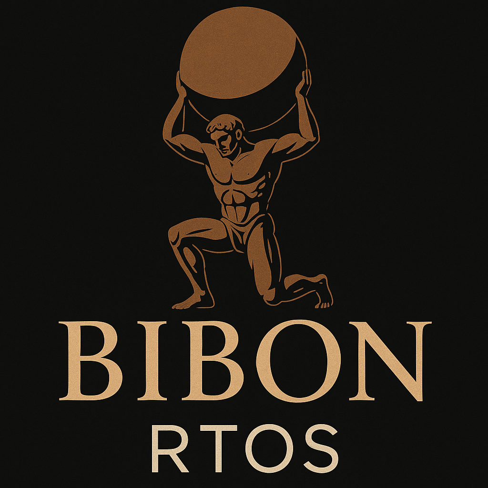

# bibon-libc
A modified musl-libc for Real-Time and time deterministic user space operations

# Custom musl-libc with RTOS Enhancements

This repository contains a custom version of [musl-libc](https://musl.libc.org/), enhanced for real-time operating system (RTOS) use cases. The project includes additional source files that enable predictable memory allocation, jitter-free behavior, and core-specific execution models suitable for low-latency systems.

## Licensing

### musl-libc
The musl-libc source code and related files retain their original license. You can find the full license details in the [`COPYRIGHT`](./COPYRIGHT) file or at [https://musl.libc.org](https://musl.libc.org/).

### Custom Files
The following files in this repository are **licensed for non-commercial use only**:

- `src/malloc/malloctlsf/tlsf.c`
- `src/malloc/malloctlsf/platform_utils.c`
- `src/malloc/malloctlsf/tlsf_debug.c`

- `include/tlsf/tlsf.h`
- `include/tlsf/tlsf_debug.h`
- `include/tlsf/platform_utils.h`

- `test/main.c`
- `test/Makefile`
- (add more files here if needed)

To **use any of the above files commercially**, you must obtain a separate commercial license. Please contact the repository maintainer for licensing inquiries.

## Disclaimer
This project is currently under development and may undergo frequent changes. Use at your own risk, especially in production or safety-critical environments.

---

For more information or commercial licensing, please open an issue or reach out directly.
